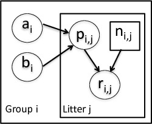

# A basic example

Here we'll give a simple example of building a model. Other modules will show how one can fit the model and give more detail on various features of NIMBLE.

We'll use the *litters* model example from BUGS. The data set describes survival of rat pups in a simple experiment.

<center></center>


# Specifying the BUGS code for a model

Here we specify the litters code directly in R. We can walk through some of details via the comments in the BUGS code.


```r
library(nimble)
littersCode <- nimbleCode({
  for (i in 1:G) {
     for (j in 1:N) {
        # likelihood (data model)
        r[i,j] ~ dbin(p[i,j], n[i,j])
        # latent process (random effects)
        p[i,j] ~ dbeta(a[i], b[i]) 
     }
     # prior for hyperparameters
     a[i] ~ dgamma(1, .001)
     b[i] ~ dgamma(1, .001)
   }
})
```


You can also load it directly from the standard BUGS example file formats (see `help(readBUGSmodel)`).

# Building a model in NIMBLE

In BUGS or JAGS, one would provide the model code, input data and constant values, and (optionally) initial parameter values and the software would directly create and run an MCMC, returning the results to you.

In NIMBLE, you have more fine-grained control over these steps. The first step is to build an R representation of the model.


```r
## data and constants as R objects
G <- 2
N <- 16
n <- matrix(c(13, 12, 12, 11, 9, 10, 
              9, 9, 8, 11, 8, 10, 13, 10, 12, 9, 10, 9, 10, 5, 9, 9, 13, 
              7, 5, 10, 7, 6, 10, 10, 10, 7), nrow = 2)
r <- matrix(c(13, 12, 12, 11, 9, 10, 9, 9, 8, 10, 8, 9, 
     12, 9, 11, 8, 9, 8, 9, 4, 8, 7, 11, 4, 4, 5, 5, 3, 7, 3, 7, 0), 
     nrow = 2)
              
littersConsts <- list(G = G, N = N, n = n)
littersData <- list(r = r)
littersInits <- list( a = c(2, 2), b=c(2, 2) )

## create the NIMBLE model object
littersModel <- nimbleModel(littersCode, 
          data = littersData, constants = littersConsts, inits = littersInits)
```

```
## defining model...
```

```
## building model...
```

```
## setting data and initial values...
```

```
## running calculate on model (any error reports that follow may simply reflect missing values in model variables) ... 
## checking model sizes and dimensions... This model is not fully initialized. This is not an error. To see which variables are not initialized, use model$initializeInfo(). For more information on model initialization, see help(modelInitialization).
## model building finished.
```

If all you want to do is run an MCMC, NIMBLE's fine-grained control might not be so interesting to you, in which case you can just use `nimbleMCMC()` without using `nimbleModel()` to create the model. But by providing an explicit model object, we allow you to operate the model and program with it.

# Compiling a model

In general, you'll want a version of the model that allows for fast computation (this can then be used by any algorithms you use on the model).

To create a fast compiled version of the model, you simply do this.


```r
cLittersModel <- compileNimble(littersModel)
```

```
## compiling... this may take a minute. Use 'showCompilerOutput = TRUE' to see C++ compilation details.
```

```
## compilation finished.
```
# Operating a model

You can view and manipulate the values of variables in the model, and calculate (prior or likelihood) densities and simulate from the prior or likelihood in a model.

In later modules, we'll see why this is useful for

 - programming algorithms
 - working with your model (e.g., doing a simulation study)


```r
cLittersModel$p
```

```
##      [,1] [,2] [,3] [,4] [,5] [,6] [,7] [,8] [,9] [,10] [,11] [,12] [,13]
## [1,]   NA   NA   NA   NA   NA   NA   NA   NA   NA    NA    NA    NA    NA
## [2,]   NA   NA   NA   NA   NA   NA   NA   NA   NA    NA    NA    NA    NA
##      [,14] [,15] [,16]
## [1,]    NA    NA    NA
## [2,]    NA    NA    NA
```

```r
cLittersModel$calculate('a')   # log-prior density
```

```
## [1] -13.81951
```

```r
cLittersModel$getLogProb('a')
```

```
## [1] -13.81951
```

```r
cLittersModel$a <- c(3, 3)
cLittersModel$getLogProb('a')
```

```
## [1] -13.81951
```

```r
cLittersModel$calculate('a')   # log-prior density
```

```
## [1] -13.82151
```

```r
set.seed(1)  # so the calculations are reproducible
littersModel$simulate('p')  # simulate from prior
littersModel$p
```

```
##           [,1]      [,2]      [,3]      [,4]      [,5]      [,6]      [,7]
## [1,] 0.3275025 0.5516990 0.2743131 0.8814780 0.5923401 0.2780523 0.6355158
## [2,] 0.4954329 0.7517793 0.7221339 0.6639406 0.7458808 0.7124073 0.5210273
##            [,8]      [,9]     [,10]     [,11]     [,12]     [,13]
## [1,] 0.70135781 0.6591489 0.4143388 0.8678220 0.6089581 0.3288683
## [2,] 0.06657146 0.6707607 0.4841694 0.4561155 0.1392273 0.3669903
##           [,14]     [,15]     [,16]
## [1,] 0.04563478 0.7928597 0.4873260
## [2,] 0.61664857 0.8403967 0.4710227
```

```r
littersModel$getLogProb('p')  # log prob not yet updated!
```

```
## [1] NA
```

```r
littersModel$calculate('p')   # update it
```

```
## [1] 3.853148
```

```r
littersModel$getLogProb('p')  # now we're good
```

```
## [1] 3.853148
```
